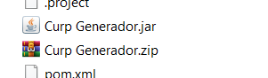
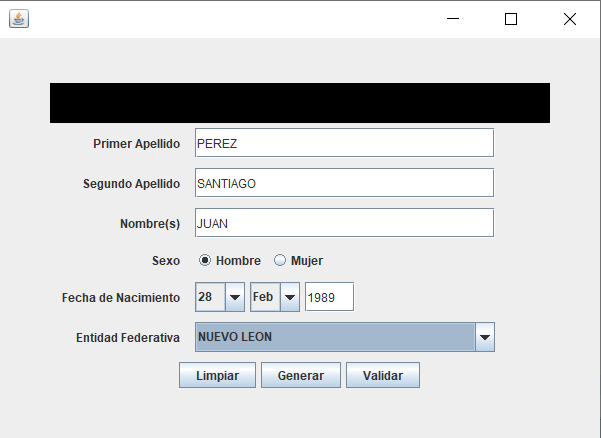
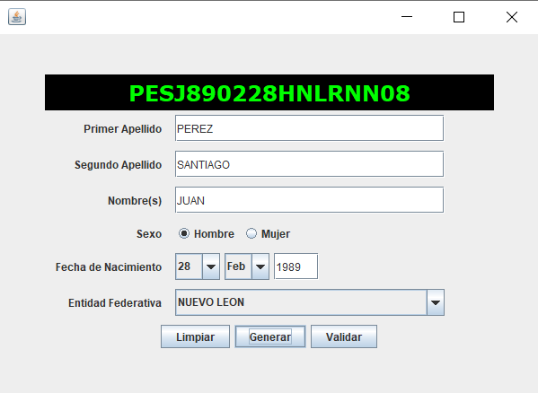
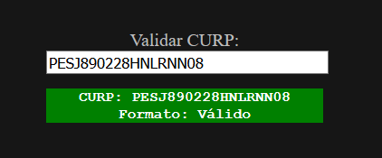
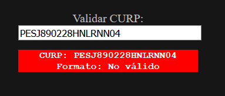

# Curp-Generator

Programa que genera una CURP válida de México con sus respectivas reglas en base al [Diario Oficial de la Federación](https://www.dof.gob.mx/nota_detalle.php?codigo=5526717&fecha=18/06/2018)

## Contenido

- [Descripcion](#descripcion)
- [Uso](#uso)
- [Validacion](#validacion)
- [Codigo](#codigo)

## Descripcion

La CURP se forma de acuerdo a las siguientes características:

- Inicial de primer apellido
- Primera vocal interna del apellido
- Iniciales del segundo apellido y el nombre
- Dos dígitos del año
- Dos dígitos del mes
- Dos dígitos del dia
- Sexo (H/M)
- La entidad federativa en la que nació
- Las primeras consonantes internas de apellidos y nombre 
- Homoclave
- Dígito Verificador

## Uso

En el proyecto hay un archivo llamado __Curp Generador.zip__, descromprimimos el archivo .zip y obtendremos un ejecutable llamado __Curp Generador.jar__

 

En el formulario que aparece se deben ingresar todos los campos 

Dar clic en el botón Generar y la CURP generada se podrá observar en el recuadro de arriba

## Validacion

En el [siguiente enlace](https://361253.playcode.io/) puedes validar la CURP generada incluyendo el dígito verificador

Tomamos como ejemplo el CURP generado por el formulario: __PESJ890228HNLRNN08__

Ingresamos la información y podremos verificar que la CURP generada es correcta

Si tenemos una CURP que no cumpla las características de la [Descripcion](#descripcion) entonces se podrá observar que se marca __No válido__

## Codigo

El código fuente se ubica en las carpeta *src/main/java/curp*

- CurpGenerator.java
- CurpGeneratorGUI.java 
